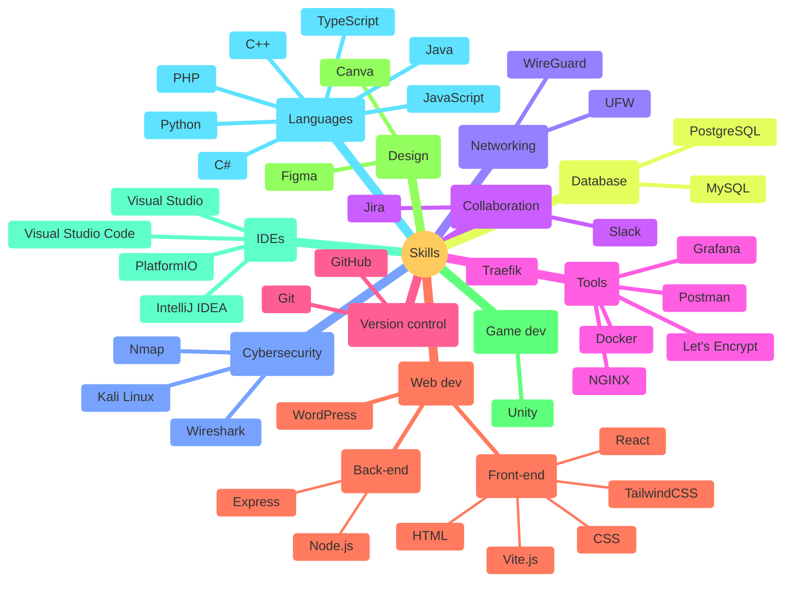

# Hi, I'm Alex 👋

## 👩‍💻 About Me

**I'm a student completing a two-year training in cybersecurity, computer science and networks.**

- 🌱 I'm currently learning some web development technologies like React, Vite, Node.js, and others.
- 📫 How to reach me: contact@alexwauquier.com
- ⚡ Fun fact: I prefer coding to gaming.
- 🌐 My website: [https://alexwauquier.com](https://alexwauquier.com)

## 💾 Skills

